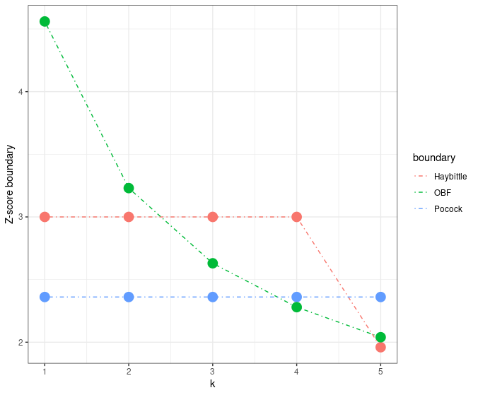

# Background

## Group sequential design

- Analyze a trial repeatedly at planned intervals
- Group of data added at each analysis
- Group sequential design derives boundaries and sample size to 
  - Control Type I error
  - Ensure power
  - Stop early for futility or efficacy finding
- Takes advantage of correlated, group sequential tests

## Independent increments process - group sequential design

- Asymptotic normal assumption works well for most trials
- @scharfstein1997semiparametric demonstrated $Z = (Z_1, \dots, Z_K)$ is asymptotically normal with independent increments.
- We extend the canonical distribution notation of @JTBook:
  - $Z_k$ is test statistic for treatment effect at analysis $k=1,\ldots,K$
  - $(Z_1,\ldots,Z_K)$ is multivariate normal
  - $E(Z_k) = \theta_k \sqrt{I_k}, k=1,\ldots,K$
  - $\hbox{Cov}(Z_{k_1}, Z_{k_2})=\sqrt{I_{k_1}/I_{k_2}},$ $1\le k_1\le k_2\le K$
- $I_k$ is the Fisher information for $\theta_k, k=1,\ldots, K$. 
- For most of this training $\theta_k=-E(\log(HR_k))$
- Simulation can be used examine accuracy of normal approximation


## Assumptions for time-to-event endpoints

- @LachinFoulkes piecewise model used to approximate arbitrary enrollment, survival, dropout patterns
  - Fixed enrollment and follow-up period
    - increase enrollment rates to obtain power
  - Proportional hazards: $\theta_k=\theta$ (constant)
  - $I_k$ ~proportional to event count @Schoenfeld1981
- We generalize to average hazard ratio (AHR; @Mukhopadhyay2020) for non-proportional hazards (NPH) tested with logrank ($\theta_k$ varies with $k$)
- Generalized to cover weighted logrank as in @YungLiu in final section today
  - Fixed design only for RMST
  - Combination tests with multiple weighted logrank tests have more complex correlation structure (@Karrison2016)

## Testing bounds 

- Bounds $-\infty \le a_k \le b_k \le \infty$ for $k=1,\dots,K$
- Null hypothesis $H_0:$ $\theta_k=0, k=1,\ldots,K$
- Alternate hypothesis $H_1:$ $\theta_k > 0$ for some $k=1,\ldots,K$
- Actions at analysis $k=1,\ldots,K$:
   - Reject $H_0$ at analysis $k$ if $Z_k\ge b_k$
   - Do not reject $H_0$ and consider stopping if $Z_k<a_k$, $k<K$
   - Continue trial if $a_k\le Z_k\le b_k$, $k<K$
- Bounds are generally considered advisory for stopping trial, not binding


## Boundary crossing probabilities

- Upper boundary crossing probabilities
  - $u_k(\theta) = \text{Pr}_\theta(\{Z_k \ge b_k\} \cap_{j=1}^{k-1} \{a_j \le Z_j < b_j\})$
- Lower boundary crossing probabilities
  - $l_k(\theta) = \text{Pr}_\theta (\{Z_k < a_k\} \cap_{j=1}^{k-1} \{a_j \le Z_j < b_j\})$
- Null hypothesis: 1-sided Type I error
  - $a_k = -\infty$ for all $k$ generally used for Type I error
    - Non-binding lower bound
  - $\alpha = \sum_{k=1}^{K} u_k(0) = \sum_{k=1}^{K} \text{Pr}(\{Z_k \ge b_k\} \cap_{j=1}^{k-1} \{a_j \le Z_j \le b_j\} \mid H_0)$

## Boundary crossing probabilities (cont.)

- Alternate hypothesis: Type II error $\beta= 1 - \hbox{power}$

  $$-\infty\le a_k<b_k, k=1,\ldots,K-1,$$
  $$a_K\le b_K$$
  
  $$1 - \beta =  \sum_{k=1}^{K} l_k = \sum_{k=1}^{K} \text{Pr}(\{Z_k < a_k\} \cap_{j=1}^{k-1} \{a_j \le Z_j \le b_j\}\mid H_1)$$
  
## Symmetric bounds

Test each treatment for superiority vs the other

```{r, echo=FALSE}
# Number of analyses
k <- 5
# See gsDesign() help for description of boundary types
test.type <- 2
# 1-sided Type I error
alpha <- 0.025
# Type 2 error (1 - targeted power)
beta <- 0.1
# If test.type = 5 or 6, this sets maximum spending for futility
# under the null hypothesis. Otherwise, this is ignored.
astar <- 0
# Timing (information fraction) at interim analyses
timing <- c(1)
# Efficacy bound spending function
sfu <- sfLDOF
# Upper bound spending function parameters, if any
sfupar <- c(0)
# Lower bound spending function, if used (test.type > 2)
sfl <- sfLDOF
# Lower bound spending function parameters, if any
sflpar <- c(0)
# Alternate hypothesis hazard ratio
hr <- 0.7
# Assumed hazard ratio under alternate hypothesis
hr <- 0.7
# Null hypothesis hazard ratio
hr0 <- 1
# Dropout rate (exponential rate)
eta <- 0.01
# Enrollment rate (normally will be inflated to achieve power)
gamma <- c(2.5, 5, 7.5, 10)
# Relative enrollment rates by time period
R <- c(2, 2, 2, 6)
# Equal length intervals for piecewise hazard rate approximation
S <- NULL
# Calendar time of final analysis
T <- 18
# Minimum follow-up time after enrollment complete
minfup <- 6
# Relative enrollment (experimental/placebo)
ratio <- 1
obs <- matrix(c(100, 6), ncol = 2)
obs <- obs[(!is.na(obs[, 1])) & (!is.na(obs[, 2])), 2]
lambdaC <- log(2) / obs

x <- gsSurv(
  k = k,
  test.type = test.type,
  alpha = alpha,
  beta = beta,
  astar = astar,
  timing = timing,
  sfu = sfu,
  sfupar = sfupar,
  sfl = sfl,
  sflpar = sflpar,
  lambdaC = lambdaC,
  hr = hr,
  hr0 = hr0,
  eta = eta,
  gamma = gamma,
  R = R,
  S = S,
  T = T,
  minfup = minfup,
  ratio = ratio
)
plot(x, xlab = "Events", main = "Symmetric bounds testing best of 2 treatments", col=c("red", "black")) +
  annotate("text", x=225, y=-.5, size = 5, color = "red", label = "Futility bound crossed with low probability under H0") +
  annotate("text", x=225, y=4.5, size = 5, label = "Efficacy bound crossed with low probability under H0")
```

Usually not of interest in pharmaceutical industry

## Futility bounds

Give up if experimental arm not trending in favor of control?

```{r, echo=FALSE, out.height="75%"}
# Number of analyses
k <- 5
# See gsDesign() help for description of boundary types
test.type <-4
# 1-sided Type I error
alpha <- 0.025
# Type 2 error (1 - targeted power)
beta <- 0.1
# If test.type = 5 or 6, this sets maximum spending for futility
# under the null hypothesis. Otherwise, this is ignored.
astar <- 0
# Timing (information fraction) at interim analyses
timing <- c(1)
# Efficacy bound spending function
sfu <- sfLDOF
# Upper bound spending function parameters, if any
sfupar <- c(0)
# Lower bound spending function, if used (test.type > 2)
sfl <- sfLDOF
# Lower bound spending function parameters, if any
sflpar <- c(0)
# Alternate hypothesis hazard ratio
hr <- 0.7
# Assumed hazard ratio under alternate hypothesis
hr <- 0.7
# Null hypothesis hazard ratio
hr0 <- 1
# Dropout rate (exponential rate)
eta <- 0.01
# Enrollment rate (normally will be inflated to achieve power)
gamma <- c(2.5, 5, 7.5, 10)
# Relative enrollment rates by time period
R <- c(2, 2, 2, 6)
# Equal length intervals for piecewise hazard rate approximation
S <- NULL
# Calendar time of final analysis
T <- 18
# Minimum follow-up time after enrollment complete
minfup <- 6
# Relative enrollment (experimental/placebo)
ratio <- 1
obs <- matrix(c(100, 6), ncol = 2)
obs <- obs[(!is.na(obs[, 1])) & (!is.na(obs[, 2])), 2]
lambdaC <- log(2) / obs

x <- gsSurv(
  k = k,
  test.type = test.type,
  alpha = alpha,
  beta = beta,
  astar = astar,
  timing = timing,
  sfu = sfu,
  sfupar = sfupar,
  sfl = sfl,
  sflpar = sflpar,
  lambdaC = lambdaC,
  hr = hr,
  hr0 = hr0,
  eta = eta,
  gamma = gamma,
  R = R,
  S = S,
  T = T,
  minfup = minfup,
  ratio = ratio
)
plot(x, xlab = "Events", main = "Futility bounds only testing if experimental better", col=c("red", "black")) +
  annotate("text", x=240, y=-1.5, size = 5, color = "red", label = "Futility bound crossed with low probability under H1") +
  annotate("text", x=240, y=4.5, size = 5, label = "Efficacy bound crossed with low probability under H0")
```

- Ethics of continuing trial if unlikely to show superiority?
- Excess risk of crossing lower bound too soon?


## Asymmetric 2-sided testing

Give up if experimental arm trending worse than control

```{r, echo=FALSE}
# Number of analyses
k <- 5
# See gsDesign() help for description of boundary types
test.type <- 6
# 1-sided Type I error
alpha <- 0.025
# Type 2 error (1 - targeted power)
beta <- 0.1
# If test.type = 5 or 6, this sets maximum spending for futility
# under the null hypothesis. Otherwise, this is ignored.
astar <- 0.15
# Timing (information fraction) at interim analyses
timing <- c(1)
# Efficacy bound spending function
sfu <- sfLDOF
# Upper bound spending function parameters, if any
sfupar <- c(0)
# Lower bound spending function, if used (test.type > 2)
sfl <- sfLDPocock
# Lower bound spending function parameters, if any
sflpar <- c(0)
# Alternate hypothesis hazard ratio
hr <- 0.7
# Assumed hazard ratio under alternate hypothesis
hr <- 0.7
# Null hypothesis hazard ratio
hr0 <- 1
# Dropout rate (exponential rate)
eta <- 0.01
# Enrollment rate (normally will be inflated to achieve power)
gamma <- c(2.5, 5, 7.5, 10)
# Relative enrollment rates by time period
R <- c(2, 2, 2, 6)
# Equal length intervals for piecewise hazard rate approximation
S <- NULL
# Calendar time of final analysis
T <- 18
# Minimum follow-up time after enrollment complete
minfup <- 6
# Relative enrollment (experimental/placebo)
ratio <- 1
obs <- matrix(c(100, 6), ncol = 2)
obs <- obs[(!is.na(obs[, 1])) & (!is.na(obs[, 2])), 2]
lambdaC <- log(2) / obs

x <- gsSurv(
  k = k,
  test.type = test.type,
  alpha = alpha,
  beta = beta,
  astar = astar,
  timing = timing,
  sfu = sfu,
  sfupar = sfupar,
  sfl = sfl,
  sflpar = sflpar,
  lambdaC = lambdaC,
  hr = hr,
  hr0 = hr0,
  eta = eta,
  gamma = gamma,
  R = R,
  S = S,
  T = T,
  minfup = minfup,
  ratio = ratio
)
plot(x, xlab = "Events", main = "Futility bounds testing if experimental trending worse than control", col=c("red", "black")) +
  annotate("text", x=200, y=-.5, size = 5, color = "red", label = "Futility bound crossed with moderate probability under H0") +
  annotate("text", x=200, y=1.6, size = 5, label = "Efficacy bound crossed with low probability under H0")
```

## Sample size

- Given boundary computation, sample size solves for enrollment rate
- Fixing relative enrollment rates, dropout rates and trial duration enable @LachinFoulkes and our AHR methods
- Under proportional hazards,  you can also fix max enrollment rate and solve for trial duration [@kim1990study]
    - You can easily create scenarios here for which there is no solution 
    - Error message *An error has occurred. Check your logs or contact the app author for clarification.*
    - Need to adjust parameters until a solution is found or use @LachinFoulkes

## Boundary types

- **Approaches to calculate decision boundary:**

  - <span style="color:#00857c">The error spending approach</span>: specify boundary **crossing probabilities** at each analysis. This is most commonly done with the **error spending function** approach [@LanDeMets].

  - <span style="color:#00857c">The boundary family approach</span>: specify how big boundary values should be **relative** to each other and adjust these relative values by **a constant multiple to control overall error rates**. The commonly applied boundary family include:

    - Haybittle-Peto boundary (@haybittle1971repeated, @peto1977design)
    - Wang-Tsiatis boundary [@wang1987approximately]
      - Pocock boundary [@pocock1977group]
      - O'Brien and Fleming boundary [@o1979multiple]
    - Slud and Wei [@SludWei, @FHO] set fixed IA probabilities
      - Hybrid of boundary family/spending approach
      
# Boundary families

## Boundary family - Haybittle-Peto boundary

- **Main idea:**

  - Interim Z-score boundary: 3
  - Final Z-score boundary: 1.96 (slight $\alpha$ inflation)

<div align="center">
{ width=45% }
</div>

## Boundary family -  Haybittle-Peto (cont'd)

- **Modified Haybittle-Peto procedure 1:**

  Bonferroni adjustment:
  - For the first $K-1$ analyses, significant p-value is set as 0.001;
  - For the final analysis, significant p-value is set as $0.05 - 0.01 \times (K-1)$;
    - More generous final bound if you adjust for test correlations

- **Advantages:**
  - Avoid type I error inflation
  - Does not require equally spaced analyses


## Boundary family - Wang-Tsiatis bounds

- **Definition:**

  For 2-sided testing, @wang1987approximately defined the boundary function for the $k$-th look as
  $$
    \Gamma(\alpha, K, \Delta) k^{\Delta - 0.5},
  $$
  where $\Gamma(\alpha, K, \Delta)$ is a constant chosen so that the level of significance is equal to $\alpha$.

- **Two special cases:**

  - $\Delta = 0.5$: Pocock bounds
  - $\Delta = 0$: O'Brien-Fleming bounds.

## Wang-Tsiatis example - Pocock boundary

  For 2-sided testing, the Pocock procedure rejects at the $k$-th equally-spaced of $K$ looks if
  $$|Z_k| > c_P(K),$$
  where $c_P(K)$ is fixed given $K$ such that $\text{Pr}(\cup_{k=1}^{K} |Z_k| > c_P(K)) = \alpha$.


## Wang-Tsiatis example - Pocock boundary (cont'd)

<div style="float: left; width: 45%;">
- **Example:**

|total number of looks(K)| $\alpha = 0.01$ | $\alpha = 0.05$ | $\alpha = 0.1$ |
|:--:|:-:|:-:|:-:|
|1|2.576 | 1.960 | 1.645|
|2|2.772 |2.178 |1.875|
|4| 2.939| **2.361** |2.067|
|8| 3.078| 2.512 |2.225|
|$\infty$|$\infty$|$\infty$|$\infty$|

<font size="3">We will reject $H_0$ if $|Z(k/4)| > 2.361$ for $k = 1,2,3,4$ (final analysis).</font>
</div>

<div style="float: right; width: 50%;">

- **Weakness:**

  - Overly aggressive interim bounds
  - High price for the end of the trial.

    - <font size="3">With $\alpha = 0.05$ and 4 analyses ($k=4$), the absolute value of z-score would have to exceed 2.361 to be declared significant, including the final analysis (normally 1.96).</font>
    - <font size="3">Z=2.361 translates to a two-tailed "nominal p-value": $2(1 − \Phi(2.361))$ = 0.018.</font>

  - $c_P(K) \to +\infty$ as $K \to + \infty$.

  - Requires equally spaced looks.
</div>

## Wang-Tsiatis example - O'Brien-Fleming boundary

- Early stage: very conservative $\Rightarrow$ large boundary at the begining;
- Final stage: nominal value close to the overall value of the design $\Rightarrow \approx 1.96$.
- Regulators generally like these bounds

<div align="center">
  { width=45% }

</div>


## Wang-Tsiatis example -  O'Brien-Fleming boundary (cont'd)

<div style="float: left; width: 45%;">
|total number of looks(K)| $\alpha = 0.01$ | $\alpha = 0.05$ | $\alpha = 0.1$ |
|:--:|:-:|:-:|:-:|
|1 |2.576| 1.960| 1.645|
|2 |2.580| 1.977| 1.678|
|4 |2.609| **2.024**| 1.733|
|8 |2.648| 2.072 |1.786|
|16 |2.684 |2.114| 1.830|
|$\infty$|2.807 |2.241 |1.960|

</div>

<div style="float: right; width: 50%;">

**Example:**

- The tabled value 2.024 is the flat B-value boundary.
- The <span style="color:#00857c">flat</span> B-value boundary can be easily transformed into <span style="color:#00857c">decreasing</span> Z-score boundary by $Z(t) = B(t)/\sqrt{t}$:
  - $2.024/\sqrt{1/4} = 4.05$
  - $2.024/\sqrt{2/4} = 2.86$
  - $2.024/\sqrt{3/4} = 2.34$
  - $2.024/\sqrt{4/4} = 2.02$
</div>

## Boundary families - summary

<div align="center">
{ width=70% }
</div>

## Boundary families - summary (cont'd)

|Procedure name| Boundary|Advantages| Disadvantages|
|:-:|:----:|:---:|:-----:|
|Haybittle-Peto |  K-1 at interim analyses and 1.96 at the final analysis| simple to implement| |
|Pocock| a constant decision boundary for Z-score| | (1) requires the same level of evidence for early and late looks at the data, so it pays larger price for the final analysis ;<br> (2) requires equally spaced looks
|O'Brien-Fleming| constant B-value boundaries, steep decrease in Z-boundaries |pay smaller price for the final analysis| too conservative in the early stages? |


# Spending function boundaries


## Spending function

```{r,echo=FALSE}
library(ggrepel)
ts <- (0:100)/100
spend <- sfHSD(alpha=.025, t = ts, param = -3)$spend
timing <- c(.15, .3, .6, .8, .9, 1)
spendb <- sfHSD(alpha = .025, t = timing, param = -3)$spend
ds <- tibble::tibble(ts = timing, spend = spendb, txt = as.character(round(spendb, 5)))
qplot(x=ts, y=spend, geom="line") + ylab("Cumulative alpha-spending") + xlab("Spending time") +
  geom_point(data = ds) + ggtitle("Spending function to specify boundary crossing probabilities") +
  geom_label(data = ds, aes(x=ts, y= spend, label=txt)) + 
  annotate(x=.02,y=.025,   geom="text", size=5, hjust=0, label = "- Cumulative probability of boundary crossing") +
  annotate(x=.02,y=.0225,  geom="text", size=5, hjust=0, label = "- Timing does not have to be equally spaced") +
  annotate(x=.02,y=.02,    geom="text", size=5, hjust=0, label = "- Timing and number of analyses can be changed during trial") + 
  annotate(x=.06, y=.0175, geom="text", size=5, hjust=0, label= "- Requires treatment effect not revealed") +
  annotate(x=.02, y=.015,  geom="text", size=5, hjust=0, label= "- Z-values solved by inverse multivariate normal distribution")
```

## Lan-DeMets spending functions to approximate boundary families

```{r,echo=FALSE}
library(ggrepel)
ts <- (0:100)/100
spendO <- sfLDOF(alpha=.025, t = ts)$spend
spendP <- sfLDPocock(alpha=.025, t = ts)$spend
timing <- c(.15, .3, .6, .8, .9, 1)
spendOBF <- sfLDOF(alpha = .025, t = timing)$spend
spendPocock <- sfLDPocock(alpha = .025, t = timing)$spend
ds <- rbind(tibble::tibble(ts = ts, spend = spendO, g="O'Brien-Fleming"),
            tibble::tibble(ts = ts, spend = spendP, g="Pocock")
)
dspend <- rbind(tibble::tibble(ts = timing, spend = spendOBF, txt = as.character(round(spendOBF, 5)), g="O'Brien-Fleming"),
                tibble::tibble(ts = timing, spend = spendPocock, txt = as.character(round(spendPocock, 5)), g="Pocock")
)
ggplot(ds, aes(x=ts, y=spend, col=g)) +geom_line() + ylab("Cumulative alpha-spending") + xlab("Spending time") +
  geom_point(data = dspend) + ggtitle("Lan-DeMets (1981) spending functions approximating boundary families") +
  geom_label_repel(data = dspend, aes(x=ts, y= spend, label=txt)) +
  guides(col = guide_legend(title="Spending function"))
```

## Hwang-Shih-DeCani (gamma) spending functions

```{r,echo=FALSE}
g <- c(1, -2, -4, -8)
ts <- (0:100)/100
timing <- c(.15, .3, .6, .8, .9, 1)
ds <- NULL
dspend <- NULL
for(gamma in g){
    spend <- sfHSD(alpha=.025, t = ts, param = gamma)$spend
    spendt <- sfHSD(alpha = .025, t = timing, param = gamma)$spend
    ds <- rbind(ds,
                tibble::tibble(ts = ts, spend = spend, gamma=gamma)
    )
    dspend <- rbind(dspend,
                    tibble::tibble(ts = timing, spend = spendt, txt = as.character(round(spendt, 5)), gamma=gamma)
    )
}
ggplot(ds, aes(x=ts, y=spend, col=factor(gamma))) + geom_line() + ylab("Cumulative alpha-spending") + xlab("Spending time") +
  geom_point(data = dspend) + ggtitle("Hwang-Shih-DeCani spending functions") + 
  guides(col=guide_legend(title="gamma"))
```

## What is spending time?

- Information fraction, @LanDeMets
  - Time-to-event: fraction of planned final events in analysis
  - Normal or continuous: fraction of planned final sample size in analysis
  - Usually expected by regulators
- Calendar fraction, @LanDeMets1989 
  - Fraction of trial planned calendar duration at analysis
- Minimum of planned and actual information fraction
  - Probably not advised yet
