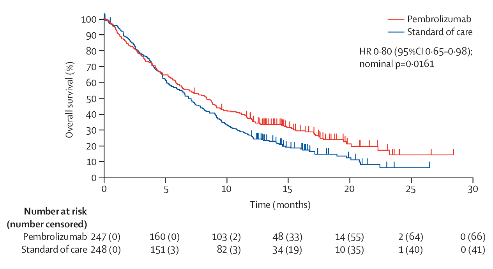

# Average hazard ratio approach

## Delayed effect {.smaller}

<div style="float: left; width: 50%;">
  - Recurrent head and neck squamous cell carcinoma
- Pembrolizumab vs Standard of Care (SOC)
- 1:1 randomization, N=495
- Primary endpoint: OS
- 90% power for HR=0.7, 1-sided $\alpha=0.025$
- Design (Am 11; [protocol](https://ars.els-cdn.com/content/image/1-s2.0-S0140673618319998-mmc1.pdf)) and results
  - Proceeded to final analysis (388 deaths; 340 planned)
    - 1-sided nominal p-value for OS: 0.0161
- 2 interim analyses planned (144 and 216 deaths; IF = 0.42, 0.64)
    - IF = information fraction
    - Efficacy: Hwang-Shih-DeCani (HSD) spending, $\gamma=-4$
    - Futility: non-binding, $\beta$-spending, HSD, $\gamma = -16$
</div>

<div style="float: right; width: 50%;">
KEYNOTE 040: Overall Survival
```{r, echo=FALSE, fig.cap="@KEYNOTE040",out.width = '100%'}

```
</div>

## Delayed effect not just in oncology

Cholesterol lowering and mortality @simva4s

```{r, echo=FALSE, fig.cap="Scandinavian Simvistatin Survival Study", out.width = '80%'}
knitr::include_graphics("../images/ahr_slides_SSSS.jpeg")
```

## Proportional hazards {.smaller}

<div style="float: left; width: 50%;">
  - First line metastatic lung CA (NSCLC)
- Chemo + Pembrolizumab vs Chemo
- 2:1 randomization, N=616
- Primary endpoints
  - Progression free survival (PFS)
  - Overall survival (OS)
- Potential for delayed OS effect not realized
- Median follow-up: 10.5 months
- Design (Am 7; [protocol](https://www.nejm.org/doi/suppl/10.1056/NEJMoa1801005/suppl_file/nejmoa1801005_protocol.pdf))
- Stopped at first IA (235 deaths; IF = 0.56)
- Plan for final analysis: 416 deaths
- Adjusted 1-sided p-value for OS: 0.00559
- O'Brien-Fleming spending
</div>

<div style="float: right; width: 50%;">
KEYNOTE 189
```{r, echo=FALSE, fig.cap="@KEYNOTE189", out.width = '100%'}

```
</div>

## Crossing survival curves {.smaller}

<div style="float: left; width: 50%;">
- Recurrent advanced gastric or gastro-oesophageal junction cancer
- Pembrolizumab vs Paclitaxel
- 1:1 randomization, N=360 planned (N=395 actual) in CPS $\ge$ 1 population
- Primary endpoints:
    - OS in PD-L1 CPS $\ge$ 1
        - 91% power for HR=0.67, 1-sided $\alpha=0.0215$
    - PFS in PD-L1 CPS $\ge$ 1
- Design (Am 11; [protocol](https://ars.els-cdn.com/content/image/1-s2.0-S0140673618312571-mmc1.pdf)) and results in CPS $\ge$ 1
    - Proceeded to final analysis (326 deaths; 290 planned)
    - 1 IA planned (240 deaths; IF = 0.83)
        - Efficacy: Hwang-Shih-DeCani (HSD) spending, $\gamma=-4$
</div>

<div style="float: right; width: 50%;">
KEYNOTE 061: Overall Survival in CPS 1
```{r, echo=FALSE, fig.cap="@KEYNOTE061",out.width = '100%'}
knitr::include_graphics("../images/ahr_slides_KEYNOTE061OS.PNG")
```
- No futility bound
- 1-sided nominal p-value for OS: 0.0421 (threshold: p=0.0135)
- *Post hoc* FH($\rho=1,\gamma=1$): p=0.0009

</div>

## Summary of issues

- What is the impact of (potentially) delayed treatment effect on trial design and analysis?
- Test statistics used (logrank for this section; next section suggests alternatives)
- Sample size vs duration of follow-up
- Timing of analyses
- Futility bounds
- Updating bounds
- Multiplicity adjustments

## Software installation

`simtrial`, `gsDesign2` and `gsdmvn` are under development and hosted on GitHub/Merck.

Below is the GitHub repo link to the source code

- `simtrial`: <https://github.com/Merck/simtrial>
- `gsDesign2`: <https://github.com/Merck/gsDesign2>
- `gsdmvn`: <https://github.com/Merck/gsdmvn>

How to report issues?

- Create issue under the GitHub repo listed above.

## simtrial overview

- Time-to-event trial simulation
- Piecewise model
- Logrank and weighted logrank analysis
- Simulating fixed and group sequential design
  - Also potential to simulate adaptive design
- Reverse engineered datasets from NPH Working Group
- Validation near completion
  - Thanks to AP colleagues and Amin Shirazi

## simtrial functions

- Generating simulated datasets
  - `simfix()`: Simulation of fixed sample size design for time-to-event endpoint
  - `simfix2simPWSurv()`: Conversion of enrollment and failure rates from `simfix()` to `simPWSurv()` format
  - `simPWSurv()`: Simulate a stratified time-to-event outcome randomized trial

- Cutting data for analysis
  - `cutData()`: Cut a dataset for analysis at a specified date
  - `cutDataAtCount()`: Cut a dataset for analysis at a specified event count
  - `getCutDateForCount()`: Get date at which an event count is reached
- Analysis functions
  - `tenFH()`: Fleming-Harrington weighted logrank tests
  - `tenFHcorr()`: Fleming-Harrington weighted logrank tests plus correlations
  - `tensurv()`: Process survival data into counting process format
  - `pMaxCombo()`: MaxCombo p-value
  - `pwexpfit()`: Piecewise exponential survival estimation
  - `wMB()`: Magirr and Burman modestly weighted logrank tests
- Lower level functions
  - `fixedBlockRand()`: Permuted fixed block randomization
  - `rpwenroll()`: Generate piecewise exponential enrollment
  - `rpwexp()`: The piecewise exponential distribution

## simtrial: reverse engineered datasets

From NPH Working Group

- `Ex1delayedEffect`: Time-to-event data example 1 for non-proportional hazards working group
- `Ex2delayedEffect`: Time-to-event data example 2 for non-proportional hazards working group
- `Ex3curewithph`: Time-to-event data example 3 for non-proportional hazards working group
- `Ex4belly`: Time-to-event data example 4 for non-proportional hazards working group
- `Ex5widening`: Time-to-event data example 5 for non-proportional hazards working group
- `Ex6crossing`: Time-to-event data example 6 for non-proportional hazards working group
- `MBdelayed`: Simulated survival dataset with delayed treatment effect

## gsDesign2

- `AHR()`: Average hazard ratio under non-proportional hazards (test version)
- `eAccrual()`: Piecewise constant expected accrual
- `eEvents_df()`: Expected events observed under piecewise exponential model
- `ppwe()`: Estimate piecewise exponential cumulative distribution function
- `s2pwe()`: Approximate survival distribution with piecewise exponential distribution
- `tEvents()`: Predict time at which a targeted event count is achieved

We will focus on `AHR()`, `ppwe()`, and `s2pwe()` in this training.

## gsdmvn

Power and design functions extending the @JTBook computational model to non-constant treatment effects. Partial list of functions:

- Design and power under average hazard ratio model
  - `gs_power_ahr()`: Power computation
  - `gs_design_ahr()`: Design computations
- Bound support
  - `gs_b()`: direct input of bounds
  - `gs_spending_bound()`: spending function bounds
- Other tests
  - Design and power with weighted logrank and MaxCombo will be discussed in next section.

# The piecewise model

## Introducing the piecewise model

- Simple model to approximate arbitrary patterns of
  - Enrollment: piecewise constant enrollment rates
  - Failure rates: piecewise exponential
  - Dropout rates: piecewise exponential
- Combined tools for designing and evaluating designs
  - Asymptotic approach using average hazard ratio (AHR)
  - Simulation tools to confirm asymptotic approximations
  - No requirement for proportional hazards
  - Stick with logrank for this section

## Piecewise constant enrollment

<div style="float: left; width: 50%;">

Set up piecewise exponential enrollment rates

```{r}
enrollRates <- tibble::tribble(
  ~duration, ~rate,
  # 5/month for 6 months
  6, 5,
  # 20/month until enrollment complete
  6, 20
)
```

Get enrollment times for 150 observations

```{r}
set.seed(123)
Month <- simtrial::rpwenroll(
  n = 150,
  enrollRates = enrollRates
)
```

</div>

<div style="float: right; width: 50%;">

```{r, echo=FALSE, out.width='100%'}
enroll <- tibble::tibble(Enrollment = 1:150, Month = Month)
ggplot(enroll, aes(x = Month, y = Enrollment)) +
  geom_point(size = 2, color = "red", shape = 3) +
  scale_x_continuous(breaks = seq(0, 12, 6), lim = c(0, 12)) +
  ggtitle("Piecewise Constant Enrollment") +
  annotate(geom = "text", x = 4, y = 125, label = "Piecewise exponential interarrival times\n can approximate any enrollment pattern", size = 6) +
  annotate(geom = "text", x = 4, y = 80, label = "Enrollment duration is random", size = 6) +
  annotate(geom = "text", x = 3, y = 50, label = "5 / month for 6 months", size = 6) +
  annotate(geom = "text", x = 10, y = 40, label = "20 / month until \n enrollment complete", size = 6) +
  theme_bw() +
  theme(
    axis.text = element_text(size = 11, colour = "black"),
    axis.title = element_text(size = 12, face = "bold"),
    title = element_text(size = 18)
  )
```
</div>

## Question

- Should we assume all enrollment
  - by targeted time?
  - *random, expected enrollment matches target at targeted time?*
- **simtrial** package assumes the latter
  - Also used in AHR approach here
- **npsurvSS** package assumes the former
  - Used for weighted logrank and combination tests in next section

## Failure rates

<div style="float: left; width: 50%;">

Note: under exponential distribution, median ($m$) and failure rate ($\lambda$) related:

$$
  \begin{align}
    m=&\log(2)/\lambda \\
    \lambda=&\log(2)/m \\
  \end{align}
$$

Specify failure rates and dropout rates in same table

```{r, warning=FALSE, message=FALSE}
# Control: exponential with 15 month median
# HR: 1 for 4 months, 0.6 thereafter
failRates <- tibble::tribble(
  ~Stratum, ~duration, ~failRate, ~hr, ~dropoutRate,
  "All", 4, log(2) / 15, 1, .001,
  "All", 100, log(2) / 15, 0.6, .001
)
```
</div>

<div style="float: right; width: 50%;">
```{r, warning=FALSE, message=FALSE, echo=FALSE, out.width='100%'}
ggplotColours <- function(n = 6, h = c(0, 360) + 15) {
  if ((diff(h) %% 360) < 1) h[2] <- h[2] - 360 / n
  hcl(h = (seq(h[1], h[2], length = n)), c = 100, l = 65)
}
m <- 15
lam <- log(2) / m
ti <- (0:100) / 100 * 36
x <- rbind(
  tibble(Treatment = "Control", Month = ti, Survival = exp(-lam * ti)),
  tibble(
    Treatment = "Experimental", Month = ti,
    Survival = c(exp(-lam * ti[ti <= 4]), exp(-lam * 4 + -lam * .6 * (ti[ti > 4] - 4)))
  )
)
ggplot(x, aes(x = Month, y = Survival, col = Treatment)) +
  geom_line(size = 2) +
  scale_x_continuous(breaks = seq(0, 36, 6)) +
  scale_y_continuous(breaks = seq(0, 1, .25)) +
  ggtitle("Piecewise Exponential NPH Survival") +
  annotate(geom = "text", x = 12, y = .9, label = "HR = 1 for 4 months", size = 6) +
  annotate(geom = "text", x = 13, y = .3, label = "HR = 0.6 after 4 months", size = 6) +
  annotate(geom = "text", x = 6, y = .5, label = "Exponential, median = 15", size = 5, color = ggplotColours(1)) +
  theme_bw() +
  theme(
    axis.text = element_text(size = 11, colour = "black"),
    axis.title = element_text(size = 12, face = "bold"),
    legend.text = element_text(size = 11),
    legend.position = c(.75, .75),
    legend.background = element_blank(),
    legend.box.background = element_rect(colour = "black"),
    title = element_text(size = 18)
  )
```

</div>

## Piecewise exponential approximation

<div style="float: left; width: 50%;">
```{r,message=FALSE,warning=FALSE}
dloglogis <- function(x, alpha = 1, beta = 4) {
  1 / (1 + (x / alpha)^beta)
}
times10 <- c(seq(1 / 3, 1, 1 / 3), 2, 3)
# Use s2pwe() to generate piecewise approximation
gsDesign2::s2pwe(
  times = times10, survival =
    dloglogis(times10, alpha = .5, beta = 4)
) %>%
  gt() %>%
  fmt_number(col = 1:2, decimals=3)
```

</div>

<div style="float: right; width: 50%;">
- Approximating log-logistic distribution plotted above using piecewise model here
- Can approximate any survival distribution

```{r, warning=FALSE, message=FALSE, echo=FALSE, out.width='100%'}
dloglogis <- function(x, alpha = 1, beta = 4) {
  1 / (1 + (x / alpha)^beta)
}
times <- (1:150) / 50
xx <- tibble(Times = times, Survival = dloglogis(times, alpha = .5, beta = 4)) %>%
  mutate(
    duration = Times - lag(Times, default = 0),
    H = -log(Survival),
    rate = (H - lag(H, default = 0)) / duration / 3
  ) %>%
  select(duration, rate)
times10 <- c(seq(1 / 3, 1, 1 / 3), 2, 3)
yy <- tibble(Times = times10, Survival = dloglogis(times10, alpha = .5, beta = 4)) %>%
  mutate(
    duration = Times - lag(Times, default = 0),
    x = lag(Times, default = 0),
    H = -log(Survival),
    rate = (H - lag(H, default = 0)) / duration / 3
  ) %>%
  select(Times, x, rate)
ggplot(data = xx %>% mutate(Time = lag(cumsum(duration), default = 0)), aes(x = Time, y = rate)) +
  geom_line(size = 2) +
  geom_segment(data = yy, aes(x = x, xend = Times, y = rate, yend = rate)) +
  annotate(geom = "text", x = 1.75, y = .3, label = "Large # of points would approximate more exactly", size = 5, col = 2) +
  ylab("Hazard Rate") +
  ggtitle("Umbrella-shaped hazard rate") +
  theme_bw() +
  theme(
    axis.text = element_text(size = 18, colour = "black"),
    axis.title = element_text(size = 18, face = "bold"),
    title = element_text(size = 18)
  )
```

</div>

## Approximating using piecewise model

```{r, warning=FALSE, message=FALSE, echo=FALSE, out.width='100%', out.height="85%"}
dloglogis <- function(x, alpha = 1, beta = 4) {
  1 / (1 + (x / alpha)^beta)
}
times <- (0:150) / 50
times10 <- c(seq(0, 1, 1 / 3), 2, 3)
xx <- tibble(
  Time = c(times, times10),
  Value = c(rep("Exact", length(times)), rep("5 point piecewise", length(times10))),
  Survival = dloglogis(c(times, times10), alpha = .5, beta = 4)
)
ggplot(xx, aes(x = Time, y = Survival, col = Value, fill = Value)) +
  geom_line(size = 2) +
  ylab("log(Survival)") +
  scale_y_log10() +
  ggtitle("Piecewise Exponential Approximation") +
  annotate(geom = "text", hjust = 0, x = 0, y = .005, label = "log-logistic distribution vs.\n 5 point piecewise approximation", size = 6) +
  annotate(geom = "text", x = 0, hjust=0, y = .001, size = 6, label="More points, closer approximation") +
  geom_point(data = tibble(
    Time = times10, Survival = dloglogis(times10, alpha = .5, beta = 4),
    Value = rep("5 point piecewise", length(times10))
  ), size = 5, shape = 24) +
  theme_bw() +
  theme(
    axis.text = element_text(size = 18, colour = "black"),
    axis.title = element_text(size = 18, face = "bold"),
    legend.text = element_text(size = 18),
    legend.position = c(.75, .75),
    legend.background = element_blank(),
    legend.box.background = element_rect(colour = "black"),
    title = element_text(size = 18)
  )
```
</div>

# Average hazard ratio

## Overview

- Definition of average hazard ratio
- Literature review
- Asymptotic theory for group sequential design
- Verification by simulation

## Average hazard ratio (AHR)

- Geometric mean hazard ratio (@Mukhopadhyay2020)
- Exponentiate: average $\log(\hbox{HR})$ weighted by expected events per interval

```{r, warning=FALSE, message=FALSE, echo=FALSE}
library(dplyr)
library(tibble)
library(ggplot2)

tibble::tibble(
  Interval = c("0-4", ">4"),
  HR = c(1, .6),
  "-ln(HR)" = round(c(0, -log(.6)), 2),
  "Expected Events" = c("d1", "d2")
) %>%
  gt() %>% cols_align(align = "center", columns = everything())
```

$$\hbox{AHR} = \exp\left( \frac{d_1 \log(1) + d_2 \log(0.6)}{d_1 + d_2}\right)$$

## Approach to asymptotic theory

- Assume $(t_{m-1},t_m]$ that the hazard rate $\lambda_m$ is constant
- Assume total time (all observations) in interval is $T_m$ (total time on test)
- Assume event count in interval is $D_m$
- Hazard rate estimate in this interval:
$$\hat{\lambda}_m= D_m/T_m$$
- Asymptotic approximation (delta method; see [Lu Tian slides](https://web.stanford.edu/~lutian/stat331.HTML))
$$\log(\hat\lambda)\sim \hbox{Normal}(\log(\lambda_m),\sigma^2=1/D_m).$$

## Log hazard ratio estimate

- Now consider hazard ratio for two treatment arms, $j=0,1$ (0=control, 1=experimental)
- Same exponential model
- Log hazard ratio in interval
$$\beta_m=\log(\lambda_{1m}/\lambda_{0m})=\log(\lambda_{1m}) - \log(\lambda_{0m})$$
- Asymptotic approximation
$$\hat{\beta}_m\sim \hbox{Normal}(\beta_m,1/D_{0m}+ 1/D_{1m})$$
- Now we replace $D_{0m}, D_{1m}$ with their expected values  $E(D_{0m}), E(D_{1m})$

## Inverse variance weighted $\beta$ {.smaller}

- Inverse variance weighting for interval $m=1,2,\ldots,M$
$$
  w_m=\frac{(1/E(D_{0m})+ 1/E(D_{1m}))^{-1}}{\sum_{j=1}^M(1/E(D_{0j})+ 1/E(D_{1j}))^{-1}}
$$
$$
  \beta=\sum_{m=1}^M w_m\beta_m
$$
- Asymptotic approximation

$$
  \hat{\beta}\sim \hbox{Normal}(\beta,\mathcal{I}^{-1})
$$
where
$$
  \mathcal{I}=\sum_{m=1}^M (1/E(D_{0m}) + 1/E(D_{1m}))^{-1}
$$
- Under null hypothesis, this is like the @Schoenfeld1981 approximation
$$
  \mathcal{I}=\xi\sum_{m=1}^M E(D_{0m})
$$
where $\xi=1/2$ for 1:1 randomization

## AHR over time

<div style="float: left; width: 50%;">
- Constant enrollment rate, 12 month targeted enrollment
- Exponential dropout, 0.001 per month
- Control: exponential, median = 15 months
- HR
    - 1 in months 0-4
    - 0.6 thereafter
</div>

<div style="float: right; width: 50%;">

```{r, warning=FALSE, message=FALSE, echo=FALSE, out.width='100%'}
xx <- gsDesign2::AHR(
  enrollRates = tibble(Stratum = "All", duration = 12, rate = 100 / 12),
  failRates = tibble::tibble(
    Stratum = "All", duration = c(4, 100),
    failRate = log(2) / 15, hr = c(1, 0.6),
    dropoutRate = rep(0.001, 2)
  ),
  totalDuration = c(.001, 4, 4.1, 4.25, 4.5, 5, seq(6, 36, 1)),
  ratio = 1,
  simple = TRUE
)
ggplot(
  xx,
  aes(x = Time, y = AHR)
) +
  geom_line(size = 2) +
  ggtitle("AHR (Geometric Average Hazard Ratio) Over Time") +
  scale_x_continuous(breaks = seq(0, 36, 6)) +
  ylab("AHR") +
  xlab("Month") +
  annotate(geom = "text", x = 20, y = .9, label = "Steep drop after 4 months\n leveling after about 24 months", size = 6) +
  theme_bw() +
  theme(
    axis.text = element_text(size = 14, colour = "black"),
    axis.title = element_text(size = 18, face = "bold"),
    title = element_text(size = 16)
  )
```
</div>

## Power by AHR

- @Schoenfeld1981 approximation works well plugging in average hazard ratio
- Use `gsDesign::nEvents()`

```{r, eval = FALSE}
Events <- 332
# if beta is NULL and n= # of events,
# power is computed instead of events required
Power <- gsDesign::nEvents(n = Events, beta = NULL, hr = c(.6, .7, .8))
```

## Power by AHR

Assume 332 events

```{r, warning=FALSE, message=FALSE, echo=FALSE}
x <- seq(.6, 1, .02)
ggplot(tibble(AHR = x, Power = gsDesign::nEvents(n = 332, beta = NULL, hr = x)), aes(x = AHR, y = Power)) +
  geom_line(size = 2) +
  scale_y_continuous(labels = scales::percent, breaks = seq(0, 1, .2)) +
  ggtitle("Power by AHR, 332 Events, alpha=0.025, 1-sided") +
  annotate(geom = "text", x = .7, y = .3, label = "Steep power decrease\n with increasing AHR", size = 6) +
  annotate(geom = "text", x = .88, y = .83, label = "Ensure follow-up sufficient\n to capture meaningful AHR", size = 6) +
  theme_bw() +
  theme(
    axis.text = element_text(size = 18, colour = "black"),
    axis.title = element_text(size = 18, face = "bold"),
    title = element_text(size = 16)
  )
```

## AHR as estimand

- Some argue this is a bad idea
  - e.g., hazards of hazard ratios (@HRhazards2010)
- Pro's
  - Estimated by Cox regression
  - AHR concept makes more clear what this is
  - Logrank is widely-accepted corresponding test
  - Both asymptotic approximations and simulation supported
    - This includes group sequential design
  - Easy to approximate arbitrary enrollment, failure and dropout patterns
- Cautions
  - No single estimand sufficently describes NPH differences
  - Early interim analysis (futility, efficacy) should anticipate possible reduced effect

## Expected accrual of endpoints

```{r, warning=FALSE, message=FALSE, echo=FALSE}
xx <- gsDesign2::AHR(
  enrollRates = tibble(Stratum = "All", duration = 12, rate = 100 / 12),
  failRates = tibble::tibble(
    Stratum = "All", duration = c(4, 100),
    failRate = log(2) / 15, hr = c(1, 0.6),
    dropoutRate = rep(0.001, 2)
  ),
  totalDuration = c(.001, seq(2, 42, 2)),
  ratio = 1,
  simple = FALSE
) %>%
  group_by(Time) %>%
  summarize(Events = sum(Events))
ggplot(xx, aes(x = Time, y = Events)) +
  geom_line(size = 2) +
  scale_y_continuous(breaks = seq(0, 100, 10)) +
  annotate(geom = "text", x = 28, y = 20, label = "Need 35-40 months until\n 65%-70% have events", size = 6) +
  scale_x_continuous(breaks = seq(0, 42, 6)) +
  ggtitle("Expected Events per 100 Enrolled") +
  theme_bw() +
  theme(
    axis.text = element_text(size = 18, colour = "black"),
    axis.title = element_text(size = 18, face = "bold"),
    title = element_text(size = 18)
  ) +
  xlab("Month")
```

## AHR asymptotic approximation

Used the following code to get AHR and information at specified times:

```{r, warning=FALSE,message=FALSE}
analysisTimes <- c(12, 20, 28, 36)
sampleSize <- 500
enrollRates <- tibble(Stratum = "All", duration = 12, rate = sampleSize / 12)
failRates <- tibble(
  Stratum = "All",
  duration = c(4, 100),
  failRate = log(2) / 15,
  hr = c(1, .6),
  dropoutRate = 0.001
)
ahr <- gsDesign2::AHR(
  enrollRates = enrollRates,
  failRates = failRates,
  totalDuration = analysisTimes,
  ratio = 1
)
```

## Simulation code considerations

- Many options for cutting data!
  - Time-based
  - Event-based
  - Max of time- and event-based
  - Limit final trial duration
- Note that
  - Code here is detailed, but (hopefully) not complicated
  - AHR changes if event-based
  - Number of events variable if time-based

## Simulation code

```{r, eval=FALSE}
# Transform to simPWSurv() format
x <- simfix2simPWSurv(failRates)
nsim <- 10000 # of simulations
# Set up matrix for simulation results
results <- matrix(0, nrow = nsim * 4, ncol = 6)
colnames(results) <- c("Sim", "Analysis", "Events", "beta", "var", "logrank")
ii <- 0 # index for results row
for (sim in 1:nsim) {
  # Simulate a trial
  ds <- simPWSurv(
    n = sampleSize,
    enrollRates = enrollRates,
    failRates = x$failRates,
    dropoutRates = x$dropoutRates
  )
  for (j in seq_along(analysisTimes)) {
    # Cut data at specified analysis times
    # Use cutDataAtCount to cut at event count
    dsc <- ds %>% cutData(analysisTimes[j])
    ii <- ii + 1
    results[ii, 1] <- sim
    results[ii, 2] <- j
    results[ii, 3] <- sum(dsc$event)
    cox <- coxph(Surv(tte, event) ~ Treatment, data = dsc)
    results[ii, 4] <- as.numeric(cox$coefficients)
    results[ii, 5] <- as.numeric(cox$var)
    # Logrank test
    Z <- dsc %>%
      tensurv(txval = "Experimental") %>%
      tenFH(rg = tibble::tibble(rho = 0, gamma = 0))
    results[ii, 6] <- as.numeric(Z$Z)
  }
}
```

```{r, echo=FALSE}
load(file = "../data/ahrsim10k.RData")
```

## Simulation summary

Simulation summary based on 10k replications

```{r}
results <- tibble::as_tibble(results)
simsum <- results %>%
  group_by(Analysis) %>%
  summarize(
    AHR = exp(mean(beta)), Events = mean(Events),
    info = 1 / mean(var(beta)), info0 = Events / 4
  )
```

## Comparison of asymptotics vs simulation

<div style="float: left; width: 50%;">
Asymptotic Approximation
```{r, echo=FALSE}
ahr %>%
  gt() %>% cols_align(align = "center", columns = everything()) %>%
  fmt_number(columns=everything(), decimals=2)
```
</div>

<div style="float: right; width: 50%;">
10k simulations
```{r, echo=FALSE}
simsum %>%
  select(-Analysis) %>%
  gt() %>% cols_align(align = "center", columns = everything()) %>%
  fmt_number(columns=everything(), decimals=2)
```
</div>

- Simulations represent *truth* since they are from actual distribution
- Note that asymptotic `info0` seems a better approximation of simulation than  `info`
- Using both `info0` and `info` in design will make sample size a little more conservative
  - Not as conservative as simulation `info`

## Distribution of Cox coefficient

```{r,fig.height=3.5}
ggplot(results, aes(x = factor(Analysis), y = beta)) +
  geom_violin() +
  ggtitle("Distribution of Cox Coefficient by Analysis") +
  xlab("Analysis") +
  ylab("Cox coefficient")
```

## Variability of results

9 simulations

```{r, echo=FALSE, fig.height=3.5}
res <- filter(results, Sim < 10) %>%
  mutate(Sim = factor(Sim), Analysis = factor(Analysis))
ggplot(res, aes(x = Analysis, y = exp(beta), group = Sim, col = Sim)) +
  geom_line(show.legend = FALSE) +
  geom_point(aes(shape = Analysis), show.legend = FALSE) +
  scale_y_log10(breaks = seq(.6, 1.1, .1)) +
  ylab("HR")
```

Question: Do you really want to adapt sample size based on an early interim estimate of treatment effect?

## Asymptotic approximation

- Use of @Tsiatis (also extends to weighted logrank)
- Statistical information proportional to expected event counts as in @Schoenfeld1981
- Natural parameter: $\log(\hbox{AHR})$
- Statistical information still proportional to number of events
- Correlation still computed based on statistical information
- Extension of @JTBook calculations to non-constant effect size over time

## Asymptotic distribution simplified

Statistical information at analysis: $\mathcal{I}_k$, $1\le k\le K$

Proportion of final information at analysis $k$: $t_k =\mathcal{I}_k / \mathcal{I}_K$

$$Z_k\sim \hbox{Normal}(\sqrt{\mathcal{I}_k} \theta(t_k),1)$$
Multivariate normal with correlations for $1\le j\le k\le K$:

$$\hbox{Corr}(Z_j,Z_k)=\sqrt{t_j/t_k}$$

## General theory to AHR translation

- Previously, Cox $\hat\beta$ was shown to be approximately a weighted $\log(AHR)$
- How do we translate to extended *canonical form* with $\theta(t_k)$, $\mathcal{I_k}$, $1\le k\le K$?
  - Assume piecewise model
  - Fix some $k$ in $1,2,\ldots,K$
    - Fix calendar time of analysis $k$ relative to opening of enrollment; can solve for this if event-based spending fraction desired
    - Compute $\mathcal{I_k}$ as before based on expected events
    - Compute $t_k=\mathcal{I}_k/\mathcal{I}_K$
    - Compute expected Cox coefficient $\beta$ ($=\log(AHR)$) as before and set $\theta(t_k)=\beta$
- We now have *canonical form* for the piecewise model

# Group sequential design with spending bounds

## Recalling assumptions

```{r}
analysisTimes <- c(12, 20, 28, 36)
sampleSize <- 500
```

`enrollRates`

```{r, warning=FALSE,message=FALSE, echo=FALSE }
library(survival)
library(dplyr)
library(simtrial)
library(gsDesign)
library(gsDesign2)
library(gsdmvn)
enrollRates <- tibble(Stratum = "All", duration = 12, rate = sampleSize / 12)
failRates <- tibble(
  Stratum = "All",
  duration = c(4, 100),
  failRate = log(2) / 15,
  hr = c(1, .6),
  dropoutRate = 0.001
)
enrollRates %>% gt() %>% fmt_number(col=3, decimals=1)
```

`failRates`

```{r, echo=FALSE}
failRates %>% gt()%>% fmt_number(col = 3, decimals = 3)
```

## Interim and final timing, effect size, information

```{r, echo=FALSE}
ahr <- gsDesign2::AHR(
  enrollRates = enrollRates,
  failRates = failRates,
  totalDuration = analysisTimes,
  ratio = 1
)
```

`ahr`

```{r, echo=FALSE}
ahr %>% gt() %>%
  fmt_number(col = 2, decimals =2) %>%
  fmt_number(col = 3:5, decimals=1)
```

Information fraction for interim analyses

```{r,echo=FALSE}
timing <- ahr$info0[1:3] / ahr$info0[4]
timing
```

# One-sided design

## One-sided design with proportional hazards (gsDesign)

```{r}
PH1sided <- gsDesign::gsSurv( # Derive Group Sequential Design
  k = 4, # Number of analyses (interim + final)
  test.type = 1, # use this for 1-sided testing
  alpha = 0.025, # 1-sided Type I error
  beta = 0.1, # Type II error (1 - power)
  timing = timing, # Information fraction for interims
  sfu = sfLDOF, # O'Brien-Fleming spending approximation
  lambdaC = failRates$failRate, # Piecewise control failure rates
  hr = ahr$AHR[4], # Used final analysis AHR
  eta = failRates$dropoutRate, # Piecewise exponential dropout rates
  gamma = enrollRates$rate, # Relative enrollment
  R = enrollRates$duration, # Duration of piecewise enrollment rates
  S = failRates$duration[1], # Duration of piecewise failure rates (K-1)
  T = max(analysisTimes), # Study duration
  minfup = max(analysisTimes) - sum(enrollRates$duration), # Minimum follow-up
  ratio = 1 # Experimental:Control randomization ratio
)
```

## One-sided design with gsSurv() {.smaller}

```{r, echo=FALSE}
gsBoundSummary(PH1sided) %>%  gt()
```

## One-sided design with gsSurv()

```{r,results='asis'}
cat(summary(PH1sided))
```

## One-sided design with gs_design_ahr()

```{r}
library(gsdmvn)
# Spending function setup
upar <- list(sf = gsDesign::sfLDOF, total_spend = 0.025)
NPH1sided <- gs_design_ahr(
  enrollRates = enrollRates,
  failRates = failRates,
  ratio = 1, alpha = .025, beta = 0.1,
  # Information fraction not required (but available!)
  analysisTimes = analysisTimes,
  # Function to enable spending bound
  upper = gs_spending_bound,
  # Spending function and parameters used
  upar = list(sf = gsDesign::sfLDOF, total_spend = 0.025),
  # Lower bound fixed at -infinity
  lower = gs_b, # allows input of fixed bound
  # With gs_b, just enter values for bounds
  lpar = rep(-Inf, 4)
)
```

## One-sided design with gs_design_ahr()

```{r, echo=FALSE}
NPH1sided$bounds %>%
  filter(Bound == "Upper") %>%
  gt() %>%
  fmt_number(col = c(1,3), decimals=0) %>%
  fmt_number(col=c(4:5, 10:11), decimals=1) %>%
  fmt_number(col=6:7, decimals=4) %>%
  fmt_number(col=8:9, decimals=3)
```

- You will want to round up events and sample size!
- Interim boundary crossing probability much lower than with PH bounds
  - IA 2 crossing probability 50% under PH
- Sample size larger than for PH (N=444, 297 events)

# Symmetric bounds

## Symmetric bounds

- Moving on to lower bounds
- Common practice is to use binding upper and lower bounds
- Here we use two one-sided tests for $\alpha-$spending
- Upper bound $b_k(\alpha)$ and lower bound $a_k(\alpha)= - b_k(\alpha)$ defined so that
$$
  \begin{align}
  f(s_k,\alpha)-f(s_{k-1},\alpha)
  =& P_0(\{Z_{k}\geq b_{k}(\alpha)\}\cap_{j=1}^{k-1}\{-b_{j}(\alpha)< Z_{j}< b_{j}(\alpha)\}\\
  =& P_0(\{Z_{k}\le -b_{k}(\alpha)\}\cap_{j=1}^{k-1}\{-b_{j}(\alpha)< Z_{j}< b_{j}(\alpha)\}
  \end{align}
$$

## Symmetric design with gsSurv() {.smaller}

```{r, echo=FALSE}
# Derive Group Sequential Design
PHsymmetric <- gsDesign::gsSurv(
  k = 4, # Number of analyses (interim + final)
  test.type = 2, # only change from before
  alpha = 0.025, # 1-sided Type I error
  beta = 0.1, # Type II error (1 - power)
  timing = timing, # Information fraction for interims
  sfu = sfLDOF, # O'Brien-Fleming spending approximation
  lambdaC = failRates$failRate, # Piecewise control failure rates
  hr = ahr$AHR[4], # Alternate hypothesis HR
  eta = failRates$dropoutRate, # Piecewise exponential dropout rates
  gamma = enrollRates$rate, # Relative enrollment
  R = enrollRates$duration, # Duration of piecewise enrollment rates
  S = failRates$duration[1], # Duration of piecewise failure rates (K-1)
  T = max(analysisTimes), # Study duration
  # Minimum follow-up
  minfup = max(analysisTimes) - sum(enrollRates$duration),
  ratio = 1 # Experimental:Control randomization ratio
)
```

```{r, echo=FALSE}
gsBoundSummary(PHsymmetric) %>%
  gt()
```

## Symmetric design with gs_design_ahr()

```{r}
library(gsdmvn)

# Spending function and parameters for both bounds
par <- list(sf = gsDesign::sfLDOF, total_spend = 0.025)
NPHsymmetric <- gs_design_ahr(
  enrollRates = enrollRates,
  failRates = failRates,
  ratio = 1, alpha = .025, beta = 0.1,
  # Information fraction not required (but available!)
  analysisTimes = analysisTimes,
  # Function to enable spending bound
  upper = gs_spending_bound,
  lower = gs_spending_bound,
  # Spending function and parameters used
  upar = par,
  lpar = par,
  binding = TRUE, # set lower bound to binding
  h1_spending = FALSE
)
```

## Symmetric design with gs_design_ahr()

```{r, echo=FALSE}
NPHsymmetric$bounds %>%
  gt() %>%
  fmt_number(col = c(1,3), decimals=0) %>%
  fmt_number(col=c(4:5, 10:11), decimals=1) %>%
  fmt_number(col=6:7, decimals=4) %>%
  fmt_number(col=8:9, decimals=3)
```

# Asymmetric bounds

## Asymmetric bounds

- Use non-binding upper bound with spending function $f_1(s,\alpha)$
- Set lower boundary crossing boundary under null hypothesis; may assume binding for lower bound with spending function $f_2(s,\gamma)$ for some chosen $0 < \gamma \le 1-\alpha$
- Set bounds to satisfy
$$
  \begin{align}
  f_1(s_k,\alpha)-f_1(s_{k-1},\alpha)
  & = P_0(\{Z_{k}\geq b_{k}(\alpha)\}\cap_{j=1}^{k-1}\{Z_{j}< b_{j}(\alpha)\}\\
  f_2(s_k,\gamma)-f_2(s_{k-1},\gamma)
  & = P_\theta(\{Z_{k}< a_{k}(\gamma)\}\cap_{j=1}^{k-1}\{a_{j}(\gamma)\le Z_{j}< b_{j}(\alpha)\}
  \end{align}
$$

## $\beta$-spending bounds

- Use non-binding upper bound with spending function $f_1(s,\alpha)$
- Set lower boundary crossing boundary under alternate hypothesis $\theta(t_k)$ (denoted $\theta$ below)
- Assume spending function $f_2(s,\gamma)$ for $\gamma$ set to Type II error; power $=1-\gamma$
- Set bounds to satisfy

$$
  \begin{align}
  f_1(s_k,\alpha)-f_1(s_{k-1},\alpha)
  &= P_0(\{Z_{k}\geq b_{k}(\alpha)\}\cap_{j=1}^{k-1}\{Z_{j}< b_{j}(\alpha)\}\\
  f_2(s_k,\gamma)-f_2(s_{k-1},\gamma)
  &= P_\theta(\{Z_{k}< a_{k}(\gamma)\}\cap_{j=1}^{k-1}\{a_{j}(\gamma)\le Z_{j}< b_{j}(\alpha)\}
  \end{align}
$$
- Generally, sample size set so that $a_K=b_K$

## $\beta$-spending design with gsSurv()  {.smaller}

```{r, echo=FALSE}
# Derive Group Sequential Design
PHasymmetric <- gsDesign::gsSurv(
  k = 4, # Number of analyses (interim + final)
  test.type = 4, # non-binding futility bound
  alpha = 0.025, # 1-sided Type I error
  beta = 0.1, # Type II error (1 - power)
  timing = timing, # Information fraction for interims
  sfu = sfLDOF, # O'Brien-Fleming spending approximation
  sfl = sfHSD, # Hwang-Shih-DeCani futility spending function
  sflpar = -2, # Accelerate early spending somewhat
  lambdaC = failRates$failRate, # Piecewise control failure rates
  hr = ahr$AHR[4], # Alternate hypothesis HR
  eta = failRates$dropoutRate, # Piecewise exponential dropout rates
  gamma = enrollRates$rate, # Relative enrollment
  R = enrollRates$duration, # Duration of piecewise enrollment rates
  S = failRates$duration[1], # Duration of piecewise failure rates (K-1)
  T = max(analysisTimes), # Study duration
  # Minimum follow-up
  minfup = max(analysisTimes) - sum(enrollRates$duration),
  ratio = 1) # Experimental:Control randomization ratio
```

```{r, echo=FALSE}
gsBoundSummary(PHasymmetric) %>% gt()
```

## $\beta$-spending design with gs_design_ahr()

```{r}
library(gsdmvn)
# Spending function setup
upar <- list(sf = gsDesign::sfLDOF, total_spend = 0.025)
lpar <- list(sf = gsDesign::sfHSD, total_spend = .1, param = -2)
NPHasymmetric <- gs_design_ahr(
  enrollRates = enrollRates,
  failRates = failRates,
  ratio = 1, alpha = .025, beta = 0.1,
  # Information fraction not required (but available!)
  analysisTimes = analysisTimes,
  # Function to enable spending bound
  upper = gs_spending_bound,
  lower = gs_spending_bound,
  # Spending function and parameters used
  upar = upar, lpar = lpar
)
```

## $\beta$-spending design with gs_design_ahr()

```{r, echo=FALSE}
NPHasymmetric$bounds %>%
  gt() %>%
  fmt_number(col = c(1,3), decimals=0) %>%
  fmt_number(col=c(4:5, 10:11), decimals=1) %>%
  fmt_number(col=6:7, decimals=4) %>%
  fmt_number(col=8:9, decimals=3)
```

## Design with interims at specified times

- Not easily done with `gsDesign::gsSurv()`
- Futility only at interim 1
  - Look for p=0.05 in the wrong direction
- Efficacy only AFTER interim 1
- This is a variation on asymmetric design
- Cannot be done (at least not easily) with **gsDesign** package
- We will use information fraction instead of calendar times of analysis

## Design with interims at specified times

```{r}
# Spending function setup
upar <- list(sf = gsDesign::sfLDOF, total_spend = 0.025)
lpar <- c(qnorm(.05), rep(-Inf, 3))
NPHskip <- gs_design_ahr(
  enrollRates = enrollRates,
  failRates = failRates,
  ratio = 1, alpha = .025, beta = 0.1,
  # Information fraction not required (but available!)
  analysisTimes = analysisTimes,
  # Upper spending bound
  upper = gs_spending_bound, upar = upar,
  # Skip first efficacy analysis
  test_upper = c(FALSE, TRUE, TRUE, TRUE),
  # Spending function and parameters used
  lower = gs_b, lpar = lpar
)
```

## Design with interims at specified times {.smaller}

```{r, echo=FALSE}
NPHskip$bounds %>%
  filter(abs(Z) < Inf) %>% # Throw out infinite bounds
  arrange(Analysis) %>% # Arrange by analysis
  gt() %>%
  fmt_number(columns = c(1,3), decimals = 0) %>%
  fmt_number(columns = c(4:5, 10:11), decimals = 1) %>%
  fmt_number(columns = 6:7, decimals=4) %>%
  fmt_number(columns = 8:9, decimals = 3)
```

# Review of multiplicity issues

## Type I error

All probabilities are under null hypothesis

- Nominal p-value: probability of rejecting for a specific test conditioning on nothing else
- Repeated p-value: $\alpha$-level at which a group sequential test would be rejected at a given analysis for a specific hypothesis
- Sequential p-value: $\alpha$-level at which a group sequential test would be rejected for all analyses performed
  - Both sequential and repeated p-values can be performed on interim data
- FWER - Given a set of hypotheses with fixed and/or group sequential designs, the FWER at which an individual hypothesis would be rejected with one of the analyses performed

# Break (10 minutes)
